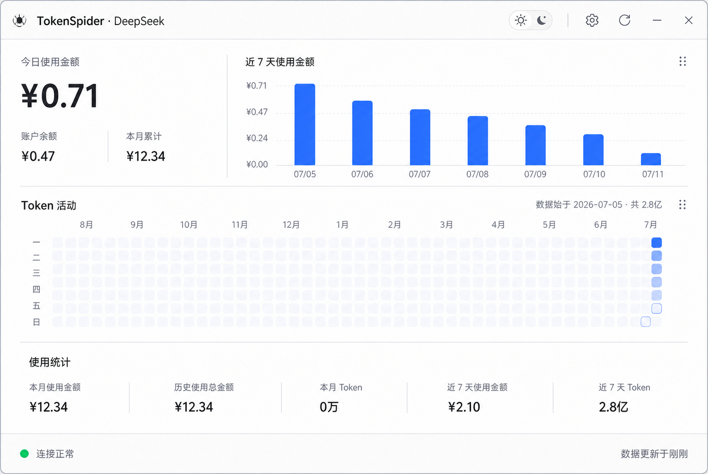
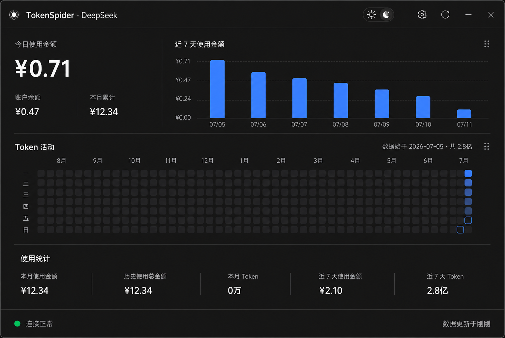

<p align="center">
  <a href="./README.md">简体中文</a> |
  <a href="./README.en.md">English</a> |
  <a href="./README.zh-TW.md">繁體中文</a> |
  <a href="./README.ja.md">日本語</a> |
  <a href="./README.ko.md">한국어</a>
</p>

# TokenMeter

<p align="center">
  <strong>AI Token Usage, Cost & Balance Monitor for Windows</strong><br>
  <sub>Track DeepSeek and Xiaomi MiMo usage from a lightweight desktop floating widget.</sub>
</p>

TokenMeter is a lightweight Windows desktop monitor for token usage, API costs, account balances, and historical trends on DeepSeek and Xiaomi MiMo. It stays in the system tray and provides a floating widget plus an expandable detail panel.

## Features

- DeepSeek and Xiaomi MiMo support with isolated per-provider caches.
- Floating widget and system tray with dragging, edge docking, position memory, and collapse on focus loss.
- Light, dark, and Windows system themes.
- Balance, token usage, cost trends, model statistics, intraday charts, and an annual activity heatmap.
- DeepSeek peak-pricing hints; MiMo Cookie collection and renewal through a dedicated Chrome profile.
- Last successful data remains visible during network failures; history is cached in local SQLite.
- API keys, Bearer tokens, and Cookies are stored in Windows Credential Manager.
- Data-directory migration, automatic updates, and single-instance operation.

## Screenshots

| Light theme | Dark theme |
| --- | --- |
|  |  |

## Requirements

- Windows 10 or Windows 11; Python 3.11+ for running from source.
- A DeepSeek or Xiaomi MiMo Token Plan account and the corresponding Cookie / Token.
- An optional DeepSeek API key for the official balance endpoint.

> [!IMPORTANT]
> Usage data depends on web-console endpoints; the MiMo Cookie must include `api-platform_ph`. Platform API or risk-control changes may temporarily affect data. Use only your own credentials and keep them secure.

## Download

Download `TokenMeter-v{version}-windows-x64.exe` from [GitHub Releases](https://github.com/zensoku142/TokenMeter/releases/latest). The portable build does not require Python. If SmartScreen warns, verify it against `SHA256SUMS.txt` first.

## Quick start

```powershell
git clone https://github.com/zensoku142/TokenMeter.git
cd TokenMeter
python -m venv .venv
.\.venv\Scripts\Activate.ps1
python -m pip install -r requirements.txt
python main.py
```

## First-time setup

1. Start the app and click the floating widget to open the panel.
2. Open Settings and select DeepSeek or Xiaomi MiMo.
3. Enter a Bearer token, Cookie, or optional DeepSeek API key. For MiMo, “Get MiMo Cookie” also extracts `api-platform_ph` automatically.
4. Save and refresh. The default refresh interval is 60 seconds.

`config.example.py` only documents fields; do not copy it to `config.py`. A legacy `config.py` is migrated on first launch when possible.

## Local data and privacy

For compatibility with earlier TokenSpider versions, TokenMeter still uses `%APPDATA%\TokenSpider` as its default data directory. Windows Credential Manager targets still begin with `TokenSpider/`, and the single-instance mutex remains `Local\TokenSpider.SingleInstance`; users do not need to sign in again. Do not manually delete or rename this directory. Any future migration to `%APPDATA%\TokenMeter` must be automatic and transactional.

Main files include `config.json`, `usage.db`, `widget-state.json`, and `TokenSpider.log`. Settings can move all data to a new empty local directory after restart; network shares are unsupported. Sensitive credentials are never written to `config.json`.

## Automatic updates

Update checks use GitHub Releases from `zensoku142/TokenMeter`. New assets use `TokenMeter-*`, while legacy `TokenSpider-*` and `TokenScope-*` assets remain recognized. Updates preserve the stable path when running as `TokenSpider.exe` or `TokenScope.exe`, keeping old shortcuts valid; versioned downloads migrate to `TokenMeter.exe`.

## Testing

```powershell
python -m pytest -q
```

Run Qt tests in an available Windows desktop session when possible.

## Build

```powershell
python -m pip install pyinstaller
.\.venv\Scripts\pyinstaller.exe --clean --noconfirm TokenMeter.spec
python scripts/build_release.py
```

The release script produces `dist\TokenMeter.exe`, `dist\TokenMeterUpdater.exe`, two versioned assets, and `dist\SHA256SUMS.txt`. The verified release stack is Python 3.12, PyInstaller 6.21, and PySide6 6.11; UPX is optional.

## Project structure

```text
TokenMeter/
├── api/providers/       # DeepSeek and Xiaomi MiMo adapters
├── data/                # Aggregation and SQLite history
├── tests/               # Unit and Qt tests
├── ui/                  # PySide6 interface
├── app_identity.py      # Display and compatibility identities
├── config_manager.py    # Configuration, credentials, and logging
├── main.py              # Application entry point
└── TokenMeter.spec      # PyInstaller configuration
```

## Troubleshooting

- Not configured: select a provider and enter credentials in Settings.
- Expired credentials: collect the Cookie again; MiMo first tries its dedicated browser session.
- Rate limit or risk control: wait before refreshing and do not repeatedly shorten the interval.
- Stale data: inspect `%APPDATA%\TokenSpider\TokenSpider.log`.
- No window: check the system tray; only one instance can run.

## Version and releases

Current version: `1.9.1`. See [GitHub Releases](https://github.com/zensoku142/TokenMeter/releases) for change notes and checksums.

## License

The repository currently has no separate license file. Contact the maintainer before use or redistribution.
